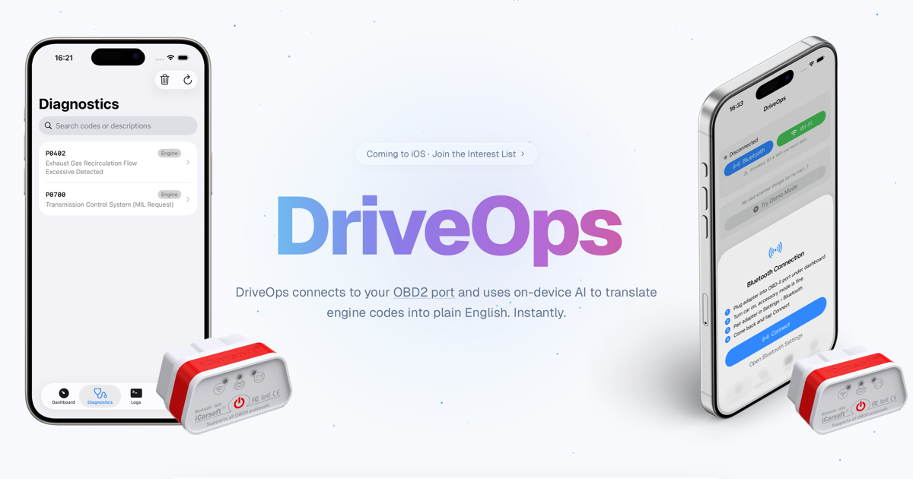
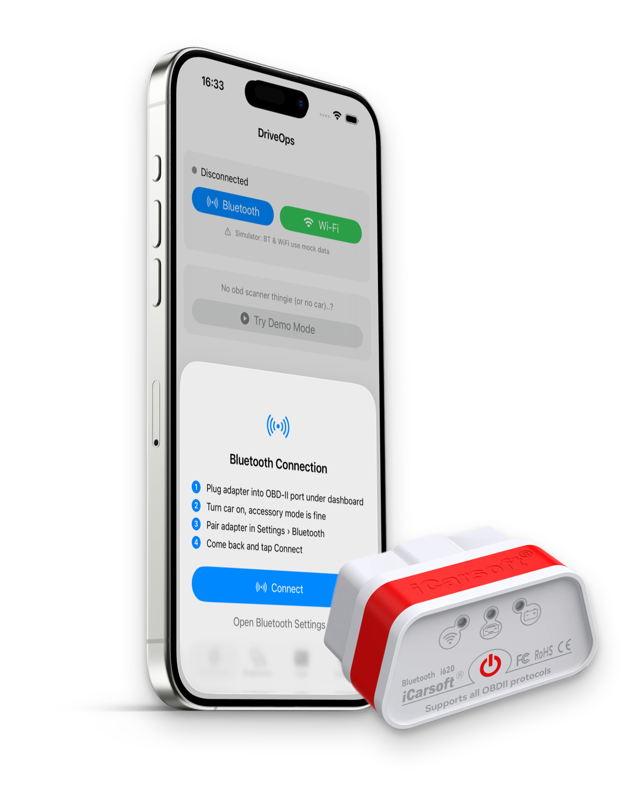
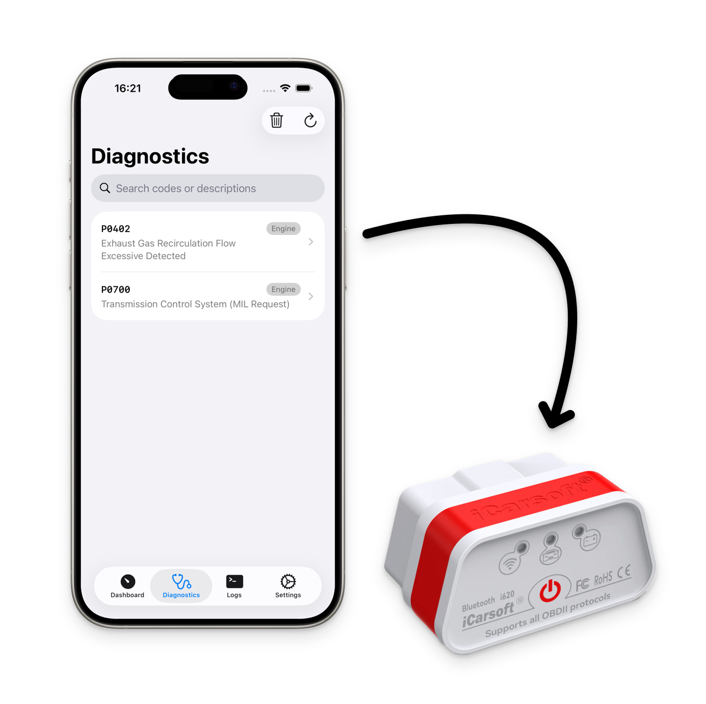

<p align="center">
  
</p>

# DriveOps

DriveOps is an iOS app that connects to your car's OBD2 port and shows you what's actually happening under the hood: live sensor data, trouble codes, and plain-English explanations, all in real time.

Plug in an ELM327 adapter, pair it over Bluetooth or Wi-Fi, and DriveOps reads your vehicle's live data stream and stored diagnostic trouble codes (DTCs) directly from the ECU.

## Features

- **Live dashboard.** RPM, speed, coolant temperature, MAF, throttle position, and more, updating in real time as you drive.
- **Metric history and comparison.** Every metric keeps a rolling history so you can chart trends, compare two metrics side by side, and pin the ones you care about.
- **Diagnostics.** Read and clear DTCs stored in the ECU, with human-readable descriptions and search.
- **Bluetooth and Wi-Fi.** Connects to ELM327-compatible adapters over either, with automatic protocol detection.
- **Demo mode.** No adapter or car handy? A driving simulator feeds realistic mock data through the same pipeline, so you can try the app cold.
- **AI code explanations.** Ask a trouble code to be explained in plain English via ChatGPT, Claude, Gemini, or Mistral.
- **iPad-optimised layouts.** Gauge grids and metric views adapt to larger screens.

<p align="center">
  
</p>

## How it works

DriveOps talks to the adapter over [EVMSwiftOBD2](https://github.com/valexa/EVMSwiftOBD2) (`develop` branch), a fork of the original SwiftOBD2 library that implements the ELM327 command set and OBD2 PID decoding. `OBDViewModel` owns the connection lifecycle, polls live data, and publishes it to the UI via Combine.

Demo mode does not go through the library at all. EVMSwiftOBD2 only serves mock data when the app runs in the iOS Simulator, so on a real device DriveOps drives demo mode with its own `DrivingSimulator`, feeding the same live-data pipeline the real adapter uses.

<p align="center">
  
</p>

The plain-English explanations don't call out to an API from the app. Instead, DriveOps builds a prompt from the selected trouble code and opens it as a deep link into your chosen AI chat provider's web app (`AIChatProvider.swift`), so you get the explanation without the app needing its own LLM backend or API key.

## Requirements

- Xcode with an iOS 26.2+ SDK
- An ELM327-compatible OBD2 adapter (Bluetooth or Wi-Fi) to use with a real vehicle, or demo mode if you don't have one

## Getting started

1. Clone the repo and open `DriveOps.xcodeproj` in Xcode.
2. Let Swift Package Manager resolve the dependencies ([EVMSwiftOBD2](https://github.com/valexa/EVMSwiftOBD2) and [AppleIntelligenceForSwiftUI](https://github.com/alessiorubicini/AppleIntelligenceForSwiftUI)).
3. Build and run on a device or simulator. Use **Try Demo Mode** on the connection screen if you don't have an adapter paired.

## Project structure

```
DriveOps/
├── Core/Services/          Connection and simulator services
├── Features/
│   ├── Dashboard/          Live metrics, gauges, history
│   ├── Diagnostics/        DTC list, search, code detail
│   ├── Logs/                Raw connection/session logs
│   ├── Onboarding/          First-run welcome flow
│   └── Settings/            App preferences
├── Shared/Components/       Reusable views (charts, cards, sheets)
├── Models/                  Data models and the AI chat provider
└── OBDViewModel.swift        Connection state and live data pipeline
```

For a deeper look at the architecture, connection lifecycle, and the reasoning behind specific decisions, see [`docs/`](docs/README.md).

## Known issues

The mock data manager bugs tracked in `swiftobd2-bug-report.md` (crash on `fuelLevel`, missing `controlModuleVoltage`) also exist upstream in EVMSwiftOBD2, since it inherited that code from the original SwiftOBD2. `OBDViewModel` works around both by excluding those two PIDs from the live-data poll.
